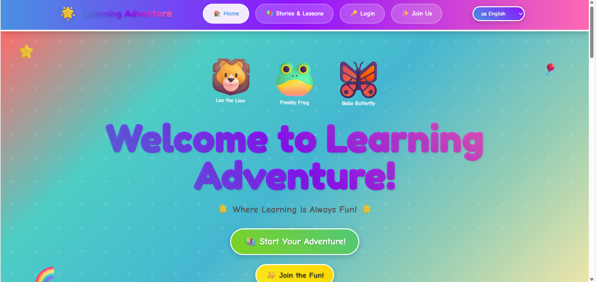
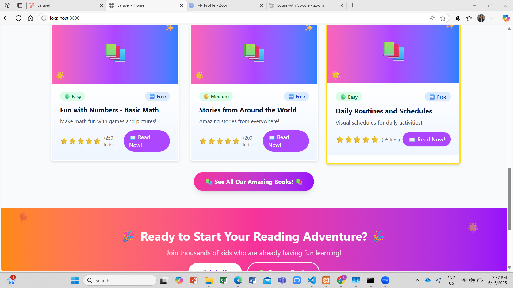

# EqualLearn

A Laravel-based video hosting platform designed for elementary students and teachers. The system allows teachers to upload learning materials while providing elementary students with safe and organized access to educational videos. Developed as the final output for the **Collaborative Online International Learning (COIL) project** on **May 26, 2025**, EqualLearn aims to facilitate remote learning and enhance classroom engagement.

## Screenshots

### Landing Page

The landing page is designed to have bright and vibrant colors with cartooning elements to attract the elementary students. 

### Home Page

All videos uploaded by teacher are shown here for the students to watch.

